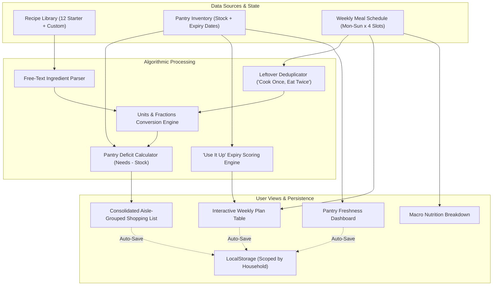

# 🥑 Pantry Meal Planner & Grocery Consolidator

[](LICENSE)
[](js/main.js)
[](index.html)
[-brightgreen)](index.html)
[](tests/test-logic.js)
[](#-quick-start)
[](#-contributing)

> **Zero-waste weekly meal scheduling, intelligent pantry inventory tracking, and algorithmic grocery list consolidation.**  
> Built with pure, dependency-free modern web technologies.

---

## 📖 Table of Contents

- [The Problem & The Solution](#-the-problem--the-solution)
- [Key Features Walkthrough](#-key-features-walkthrough)
  - [1. Weekly Meal Scheduling Grid](#1-weekly-meal-scheduling-grid)
  - [2. Leftover Planner ("Cook Once, Eat Twice")](#2-leftover-planner-cook-once-eat-twice)
  - [3. Consolidated Shopping List with Deficit Subtraction](#3-consolidated-shopping-list-with-deficit-subtraction)
  - [4. Pantry Freshness & Expiry Date Tracker](#4-pantry-freshness--expiry-date-tracker)
  - [5. 'Use It Up' Recommendation Engine](#5-use-it-up-recommendation-engine)
  - [6. Multi-Household & Isolated Pantries](#6-multi-household--isolated-pantries)
  - [7. Macro Nutrition Dashboard](#7-macro-nutrition-dashboard)
  - [8. Ink-Saving Print Layouts](#8-ink-saving-print-layouts)
- [Application Architecture & Data Flow](#-application-architecture--data-flow)
- [Algorithmic Challenges Solved](#-algorithmic-challenges-solved)
  - [Challenge 1: Free-Text Ingredient Line Parsing](#challenge-1-free-text-ingredient-line-parsing)
  - [Challenge 2: Unit Conversion & Dimension-Safe Merging](#challenge-2-unit-conversion--dimension-safe-merging)
  - [Challenge 3: Pantry Deficit Subtraction Math](#challenge-3-pantry-deficit-subtraction-math)
  - [Challenge 4: Urgency-Weighted "Use It Up" Ranking Heuristic](#challenge-4-urgency-weighted-use-it-up-ranking-heuristic)
- [Project Structure](#-project-structure)
- [Quick Start](#-quick-start)
- [Deploying to GitHub Pages](#-deploying-to-github-pages)
- [Automated Test Suite](#-automated-test-suite)
- [Recipe & Pantry JSON Schemas](#-recipe--pantry-json-schemas)
- [Accessibility & Mobile Experience](#-accessibility--mobile-experience)
- [Browser Compatibility](#-browser-compatibility)
- [Roadmap](#-roadmap)
- [Contributing](#-contributing)
- [License](#-license)

---

## 🎯 The Problem & The Solution

| The Typical Household Pain Points | How Pantry Meal Planner Solves It |
| :--- | :--- |
| **Pantry Blindness**: Buying ingredients you already own because you forgot they were in the cabinet. | **Real-Time Deficit Offset**: Automatically checks your pantry inventory and subtracts what you own from the grocery list. |
| **Food Waste**: Produce and dairy spoiling in the fridge before you get around to using them. | **'Use It Up' Engine**: Scans expiring pantry items and recommends recipes specifically designed to use them before they go bad. |
| **Grocery List Clutter**: Recipes call for `1 cup milk` on Tuesday and `250 ml milk` on Friday, resulting in redundant, unorganized notes. | **Algorithmic Consolidation**: Merges quantities across compatible units and organizes items by 9 supermarket aisles. |
| **Leftover Duplication**: Planning to eat leftover lasagna on Wednesday, but typical shopping apps still tell you to buy ingredients for two full meals. | **Cook Once, Eat Twice Logic**: Linked leftover meals automatically reuse portions and **never duplicate ingredients** on the shopping checklist. |
| **Complex App Bloat**: Modern apps require accounts, subscriptions, sync servers, and 50MB JavaScript bundles. | **100% Client-Side & Zero Dependencies**: Runs locally in any browser with instant LocalStorage persistence and zero setup. |

---

## ✨ Key Features Walkthrough

### 1. Weekly Meal Scheduling Grid
- **Monday-to-Sunday Semantic Grid**: Clean, responsive layout covering `Breakfast`, `Lunch`, `Dinner`, and `Snacks & Treats`.
- **HTML5 Drag-and-Drop**: Drag recipe cards straight from your library onto any day or meal slot. Drag scheduled meals between slots to quickly reschedule.
- **Accessible "Tap to Assign"**: Full mobile-friendly tap modal for screens or users preferring keyboard navigation.
- **Dynamic Per-Meal Serving Scaler**: Increase or decrease portions (`+` / `−`) directly inside the scheduled slot. Ingredients recalculate dynamically.
- **✨ Auto-Plan with Expiring Pantry**: One-click algorithm that detects empty schedule slots and intelligently fills them with meals that rescue expiring food.

```
+-----------------------------------------------------------------------------------+
| Weekly Meal Schedule (Monday to Sunday)                                           |
+-----------+-----------------------+-----------------------+-----------------------+
| Slot      | Monday                | Tuesday               | Wednesday ...         |
+-----------+-----------------------+-----------------------+-----------------------+
| Breakfast | 🥣 Overnight Oats (2) | 🥞 Protein Crepes (2) | 🥣 Overnight Oats (2) |
| Lunch     | 🥗 Mediterranean (2)  | 🍗 [🍱 Leftover] (2)  | 🍲 Red Lentil Dahl (2)|
| Dinner    | 🍗 Tuscan Chicken (4) | 🍝 Creamy Penne (3)   | 🍣 Salmon Bowl (2)    |
| Snacks    | 🍌 Banana Bites (1)   | 🥜 Mixed Almonds (1)  | 🍏 Apple Slices (1)   |
+-----------+-----------------------+-----------------------+-----------------------+
```

### 2. Leftover Planner ("Cook Once, Eat Twice")
- Click `🍱 +Leftover` on any scheduled dinner or lunch to schedule a linked meal for the following day.
- **Non-Duplication Guarantee**: The consolidator recognizes that leftover meals draw from the primary meal's batch. The shopping list **never requests double ingredients**.

### 3. Consolidated Shopping List with Deficit Subtraction
- **Pantry Deficit Offset**:
  - *Example:* Your schedule calls for `600g chicken breast`. Your pantry contains `250g`.
  - The grocery list shows: `Needs 600g − 250g in pantry = 350g to buy`.
- **"Covered by Pantry" Accordion**: Ingredients 100% available in your pantry are neatly tucked into a collapsible section, keeping your active shopping list clean.
- **Organized by 9 Supermarket Aisles**: Produce, Dairy & Eggs, Meat & Seafood, Bakery, Pantry & Grains, Canned & Jarred, Condiments & Spices, Frozen, and Snacks & Beverages.
- **Item Context Badges**: See exactly why an ingredient is needed (e.g. `Needed for: Mon Dinner & Wed Lunch`).
- **Interactive Checklist**: Mark items as purchased with smooth strike-through animations and persistent state.
- **Custom Additions**: Add non-recipe household essentials (*dish soap, paper towels, parchment paper*).
- **Export & Share**: Native Web Share API integration with instant plain-text clipboard fallback for WhatsApp, SMS, or Apple Notes.

### 4. Pantry Freshness & Expiry Date Tracker
- Real-time arithmetic tracks days until expiration:
  - 🔴 **Expired** (`< 0 days`) — Highlighted for immediate disposal or replacement.
  - 🟡 **Expiring Soon** (`0 to 4 days`) — Pulsing indicator with countdown badge.
  - 🟢 **Fresh** (`> 4 days`) — Safe for future planning.
  - 🏷️ **Staple / Non-Perishable** — Spices, flours, oils, and canned goods that don't expire quickly.
- **Inline Quantity Controls**: Quick increment/decrement buttons (`+` / `−`) and HTML5 `<datalist>` auto-completion.
- **Toast Notifications with Undo**: Accidental deletions can be immediately reversed with a single click.

### 5. 'Use It Up' Recommendation Engine
- Analyzes all items in your pantry nearing expiration.
- Evaluates your recipe library and ranks recipes using a **Waste Prevention Score**.
- Shows matched ingredients with urgency tags (e.g. `Expires tomorrow`, `2 days left`).
- One-click `🗓️ Schedule to Plan` button puts the recipe directly onto your weekly calendar.

### 6. Multi-Household & Isolated Pantries
- Switch effortlessly between distinct contexts:
  - 🏠 **Main Household**
  - 🎒 **Dorm / Apartment**
  - 🏢 **Office / Studio**
- Each household maintains its own isolated pantry inventory, weekly schedule, custom grocery items, and checklists.

### 7. Macro Nutrition Dashboard
- Automatically calculates daily and weekly averages:
  - 🔥 **Calories**
  - 🥩 **Protein (g)**
  - 🍞 **Carbohydrates (g)**
  - 🥑 **Fats (g)**
- Provides a high-level nutritional overview to balance high-protein dinners with lighter lunches.

### 8. Ink-Saving Print Layouts
- Includes dedicated print stylesheets (`css/print.css`).
- High-contrast, clean print layouts for both the weekly calendar grid and the aisle-grouped shopping checklist, formatted perfectly for standard A4 / US Letter paper.

---

## 🏗️ Application Architecture & Data Flow



---

## 🧮 Algorithmic Challenges Solved

### Challenge 1: Free-Text Ingredient Line Parser
*Module: [`js/parse-ingredient.js`](file:///C:/Users/USER/Desktop/Meal%20Planner/js/parse-ingredient.js)*

Extracts structured quantity, unit, ingredient name, and aisle categorization from raw recipe text:
- **Fractions & Unicode**: Converts vulgar unicode fractions (`½`, `¾`, `⅓`, `⅔`, `⅛`) and ASCII fractions (`1 1/2`, `3/4`) into accurate floats.
- **Ranges**: Averages numeric ranges (e.g. `2-3 ripe bananas` $\rightarrow$ `2.5 pieces`).
- **Missing Units & Defaults**: Intelligently identifies standalone counts (`4 cloves garlic`, `1 can chickpeas`, `pinch of salt`).
- **Aisle Classification**: Evaluates ingredient keywords against supermarket aisle dictionaries to automatically route items to Produce, Dairy, Bakery, etc.

```javascript
// Example transformation
parseIngredientLine("1 1/2 cups all-purpose flour");
// => { quantity: 1.5, unit: "cup", name: "all-purpose flour", aisle: "Pantry & Grains" }

parseIngredientLine("2-3 ripe bananas");
// => { quantity: 2.5, unit: "piece", name: "ripe bananas", aisle: "Produce" }
```

---

### Challenge 2: Unit Conversion & Dimension-Safe Merging
*Module: [`js/units.js`](file:///C:/Users/USER/Desktop/Meal%20Planner/js/units.js)*

Prevents unit clashing and loss of precision when aggregating ingredients:
- **Dimensional Verification**: Verifies compatibility between volume units (`ml`, `l`, `tsp`, `tbsp`, `fl oz`, `cup`, `pint`, `quart`, `gallon`) and mass units (`g`, `kg`, `oz`, `lb`).
- **Base Normalization**: Normalizes volume to milliliters (`ml`) and mass to grams (`g`), sums the values, and converts back to the most intuitive human-readable unit.
- **Ingredient Density Matrix**: Supports density ratios for specific kitchen ingredients (e.g., olive oil: $0.92\text{ g/ml}$, flour: $0.53\text{ g/ml}$, honey: $1.42\text{ g/ml}$).
- **Human-Friendly Fraction Formatting**: Converts decimal quantities back into fractions (`1.5` $\rightarrow$ `1 ½`, `0.75` $\rightarrow$ `¾`, `2.333` $\rightarrow$ `2 ⅓`).

```javascript
// Example: Volume consolidation across differing units
UnitsModule.mergeQuantities(1, 'cup', 250, 'ml');
// 1 cup (240ml) + 250ml = 490ml => 2.041 cups / 490 ml
```

---

### Challenge 3: Pantry Deficit Subtraction Math
*Module: [`js/units.js`](file:///C:/Users/USER/Desktop/Meal%20Planner/js/units.js) & [`js/shopping.js`](file:///C:/Users/USER/Desktop/Meal%20Planner/js/shopping.js)*

Calculates the exact delta between recipe requirements and on-hand inventory:

$$\text{Deficit} = \max\left(0, \text{Required Base Quantity} - \text{Pantry Base Quantity}\right)$$

- **Partial Deficit**: If recipes call for `600g chicken` and you own `250g`, the shopping list generates a net requirement of `350g` and badges the item: `Needs 600g − 250g in pantry = 350g to buy`.
- **Full Coverage**: When pantry stock meets or exceeds recipe demand, the item's net quantity becomes `0` and it is sorted into the collapsible "Covered by Pantry" section.
- **Leftover Safety**: Leftover meals are flagged with `isLeftover: true`. The shopping consolidator bypasses leftover meals so ingredients are never ordered twice.

---

### Challenge 4: Urgency-Weighted "Use It Up" Ranking Heuristic
*Module: [`js/pantry.js`](file:///C:/Users/USER/Desktop/Meal%20Planner/js/pantry.js)*

Prioritizes recipes that consume ingredients nearing their expiration date. Each matching expiring ingredient adds to the recipe's score based on urgency:

$$\text{Score} = \sum_{i \in \text{Matches}} W(\text{daysUntilExpiry}_i)$$

Where the weight function $W(d)$ is defined as:

$$W(d) = \begin{cases} 
3 & \text{if } d \le 1 \text{ day (Expires today or tomorrow)} \\ 
2 & \text{if } 1 < d \le 3 \text{ days (Critical)} \\ 
1 & \text{if } 3 < d \le 5 \text{ days (Soon)} 
\end{cases}$$

Recipes with higher scores are presented first in the "Use It Up" drawer, complete with match badges and direct one-click schedule placement.

---

## 📂 Project Structure

```text
Meal Planner/
├── index.html              # Main HTML5 application shell, semantic tables & accessible modals
├── README.md               # Complete project documentation and GitHub guide
├── LICENSE                 # MIT Open Source License
├── css/
│   ├── style.css           # Modern design system (CSS variables, flexbox, grid, animations)
│   └── print.css           # Ink-saving print styles for schedule & grocery checklist
├── js/
│   ├── main.js             # Master controller orchestrating state, routing, and UI lifecycle
│   ├── parse-ingredient.js # Free-text regex NLP ingredient line parser
│   ├── units.js            # Unit conversions, dimension checking & fraction formatter
│   ├── planner.js          # Weekly meal grid, serving scaling, leftovers & nutrition engine
│   ├── pantry.js           # Pantry inventory, expiry calculations & 'Use It Up' engine
│   ├── shopping.js         # Consolidated shopping list, pantry offset & aisle grouping
│   └── dnd.js              # HTML5 Drag-and-Drop API & drop-zone handlers
├── data/
│   ├── recipes.json        # 12 starter recipes with nutrition, tags & instructions
│   ├── recipes-data.js     # Embedded starter dataset (guarantees offline & file:// execution)
│   └── units.json          # Unit conversion tables, aisles & food density constants
└── tests/
    └── test-logic.js       # Node.js automated test suite verifying all 4 core algorithms
```

---

## 🚀 Quick Start

### Method 1: Zero-Install Direct Launch (Recommended)
You do not need Node.js, Python, or any web server to use the application.
1. Download or clone this repository:
   ```bash
   git clone https://github.com/YOUR_USERNAME/pantry-meal-planner.git
   ```
2. Double-click `index.html` or open it in any modern browser (`Chrome`, `Firefox`, `Safari`, `Edge`).
3. The built-in embedded data loader (`recipes-data.js`) automatically initializes state without any CORS or network restrictions!

---

### Method 2: Local HTTP Server (Optional)
If you prefer running through a local development server:

```bash
# Using Python 3
python -m http.server 8000

# Using Node.js npx
npx serve .

# Using PHP
php -S localhost:8000
```
Open your browser and navigate to `http://localhost:8000`.

---

## 🌐 Deploying to GitHub Pages

You can host this project completely free on GitHub Pages in under 60 seconds:

1. Push this repository to GitHub.
2. In your GitHub repository, navigate to **Settings** $\rightarrow$ **Pages** (under the "Code and automation" sidebar).
3. Under **Build and deployment**:
   - **Source**: Select `Deploy from a branch`.
   - **Branch**: Choose `main` (or `master`) and directory `/ (root)`.
4. Click **Save**.
5. Wait ~30 seconds, then visit your live URL:
   `https://YOUR_USERNAME.github.io/pantry-meal-planner/`

---

## 🧪 Automated Test Suite

A comprehensive test suite is included in `tests/test-logic.js` using Node.js's native `assert` module. It tests all core mathematical and algorithmic features without external test runners.

To run the tests:
```bash
node tests/test-logic.js
```

### Verified Test Suites:
- ✅ **Test 1: Free-Text Ingredient Line Parser**: Verifies fractions (`1 1/2`), metric quantities (`600g`), ranges (`2-3 bananas`), units (`cloves`, `cans`), and automatic aisle assignment.
- ✅ **Test 2: Unit Conversions & Quantity Merging**: Validates volume merging (`1 cup + 250ml`), mass merging (`500g + 1.5kg`), and unicode fraction formatting.
- ✅ **Test 3: Pantry Stock Subtraction & Deficit Math**: Checks partial deficit calculation, complete coverage, and cross-unit deficit conversion.
- ✅ **Test 4: 'Use It Up' Expiry Ranking Engine**: Verifies urgency weighting and recipe prioritization.
- ✅ **Test 5: Leftover Non-Duplication**: Confirms that linked leftover meals do not increase shopping list totals.

```text
Sample Output:
🧪 Starting Pantry Meal Planner Logic Verification Tests...

--- Test 1: Free-text Ingredient Line Parser ---
[1.1] Parsing: "1 1/2 cups all-purpose flour" -> Qty: 1.5, Unit: cup, Name: "all-purpose flour", Aisle: Pantry & Grains
[1.2] Parsing: "2 tbsp olive oil" -> Qty: 2, Unit: tbsp, Name: "olive oil", Aisle: Pantry & Grains
[1.3] Parsing: "4 cloves garlic, minced" -> Qty: 4, Unit: cloves, Name: "garlic", Aisle: Produce
...
✅ Challenge 1 passed!

--- Test 2: Unit Conversions & Quantity Merging ---
[2.1] 1 cup + 250 ml = { quantity: 2.0416666666666665, unit: 'cup' }
[2.2] 500g + 1.5kg = { quantity: 2000, unit: 'g' }
[2.3] Fraction formatting: 1.5 -> "1 ½", 0.75 -> "¾", 2.333 -> "2 ⅓"
✅ Challenge 2 passed!

--- Test 3: Subtract Pantry Stock & Handle Partial Deficits ---
[3.1] Need 600g, Pantry has 250g -> Net: 350g to buy (fullyCovered: false)
[3.2] Need 250ml, Pantry has 500ml -> Net: 0ml to buy (fullyCovered: true)
✅ Challenge 3 passed!

--- Test 4: "Use It Up" Expiry Ranking Engine ---
[4.1] Generated 7 'Use It Up' recipe suggestions:
     #1: Tuscan Garlic Herb Chicken (Score: 7, Matches: 3 expiring ingredients)
     #2: Creamy Mushroom & Spinach Penne (Score: 5, Matches: 2 expiring ingredients)
✅ Challenge 4 passed!

--- Test 5: Leftover Planner (Non-duplication of ingredients) ---
[5.1] Chicken needed in shopping list: 600 g
✅ Leftover test passed!

🎉 ALL LOGIC AND ALGORITHMIC CHALLENGES VERIFIED AND PASSING SUCCESSFULLY!
```

---

## 📋 Recipe & Pantry JSON Schemas

### Recipe Schema (`data/recipes.json`)
You can export or import custom recipes formatted according to this schema:

```json
{
  "id": "recipe-custom-1",
  "name": "Mediterranean Quinoa Salad",
  "servings": 4,
  "prepTime": 15,
  "cookTime": 15,
  "tags": ["Vegetarian", "Gluten-Free", "Quick"],
  "emoji": "🥗",
  "description": "Fluffy quinoa tossed with crisp cucumbers, cherry tomatoes, olives, and feta.",
  "ingredients": [
    { "name": "quinoa", "quantity": 200, "unit": "g", "aisle": "Pantry & Grains", "raw": "200g quinoa" },
    { "name": "cucumber", "quantity": 1, "unit": "piece", "aisle": "Produce", "raw": "1 English cucumber, diced" },
    { "name": "cherry tomatoes", "quantity": 200, "unit": "g", "aisle": "Produce", "raw": "200g cherry tomatoes, halved" },
    { "name": "olive oil", "quantity": 30, "unit": "ml", "aisle": "Pantry & Grains", "raw": "2 tbsp extra virgin olive oil" }
  ],
  "instructions": [
    "Rinse quinoa and cook in 400ml water until fluffy.",
    "Toss cooked quinoa with chopped vegetables, olive oil, and lemon juice.",
    "Chill for 15 minutes before serving."
  ],
  "nutritionPerServing": {
    "calories": 320,
    "protein": 9,
    "carbs": 42,
    "fat": 14
  }
}
```

### Pantry Item Schema
```json
{
  "id": "pantry-item-123",
  "name": "chicken breast",
  "quantity": 250,
  "unit": "g",
  "aisle": "Meat & Seafood",
  "expiryDate": "2026-10-08",
  "notes": "Freezer pack"
}
```

---

## ♿ Accessibility & Mobile Experience

- **Semantic HTML**: Fully structured with `<header>`, `<nav>`, `<main>`, `<section>`, and semantic `<table>` elements with accessible `<caption>`, `<th scope="col">`, and `<th scope="row">` associations.
- **Keyboard & Screen Reader Navigable**: Modals support `Esc` key dismissals, focus trapping, and ARIA attributes (`role="tablist"`, `aria-selected`, `aria-expanded`).
- **Touch-Friendly Alternatives**: Drag-and-drop actions have equivalent "Tap to Assign" button triggers on all recipe cards and meal slots.
- **Fluid Layout**: Fully responsive CSS Grid and Flexbox layouts adapted for desktops, tablets, and smartphones.

---

## 💻 Browser Compatibility

Tested and compatible across all modern evergreen browsers:

| Browser | Supported Version | Notes |
| :--- | :--- | :--- |
| **Google Chrome** | 80+ | Full Support (Drag & Drop, Web Share API, LocalStorage) |
| **Mozilla Firefox** | 78+ | Full Support |
| **Apple Safari** | 13.1+ | Full Support (iOS & macOS) |
| **Microsoft Edge** | 80+ | Full Support |
| **Mobile Browsers** | All Modern | Tap-to-assign, touch scrolling, share fallback |

---

## 🗺️ Roadmap

- [ ] **PWA (Progressive Web App)**: Add service worker caching and manifest for native mobile installation.
- [ ] **Barcode Scanner**: Camera-based barcode scanner for rapid pantry stock logging.
- [ ] **Budget & Grocery Cost Estimator**: Track estimated meal and weekly grocery costs.
- [ ] **Meal Plan History & Templates**: Save reusable weekly plan templates (e.g. "Low Carb Week", "Budget Prep").

---

## 🤝 Contributing

Contributions are welcomed! If you'd like to contribute:

1. **Fork the Repository** on GitHub.
2. **Create a Feature Branch**:
   ```bash
   git checkout -b feature/amazing-feature
   ```
3. **Commit your Changes**:
   ```bash
   git commit -m "Add amazing feature"
   ```
4. **Run Tests to Ensure No Regressions**:
   ```bash
   node tests/test-logic.js
   ```
5. **Push to the Branch**:
   ```bash
   git push origin feature/amazing-feature
   ```
6. **Open a Pull Request**.

---

## 📄 License

This project is licensed under the **MIT License** — see the [LICENSE](LICENSE) file for details.

---

<p align="center">
  Built with ❤️ for sustainable living, zero food waste, and stress-free grocery shopping.
</p>
